# Exp1 无人值守安装ISO制作过程实验报告
### 一、实验目的
- 配置无人值守安装iso并在Virtualbox中完成自动化安装
- Virtualbox安装完Ubuntu之后新添加的网卡实现系统开机自动启用和自动获取IP
- 如何使用sftp在虚拟机和宿主机之间传输文件

### 二、实验环境
- windows10 && linux ubuntu-16.04.1-server
- NAT && Host-Only 

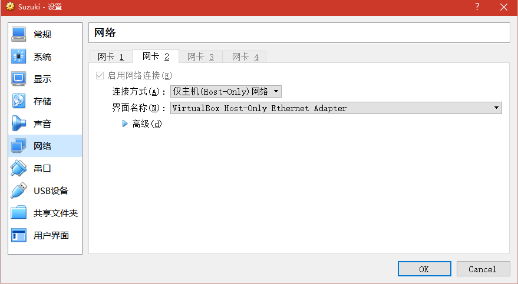

### 三、实验过程
- 查看网卡状态

		ifconfig 
- 配置网卡 因为设置的是双网卡，还需新添加一个网卡并动态分配地址

        sudo dhclient enp0s8
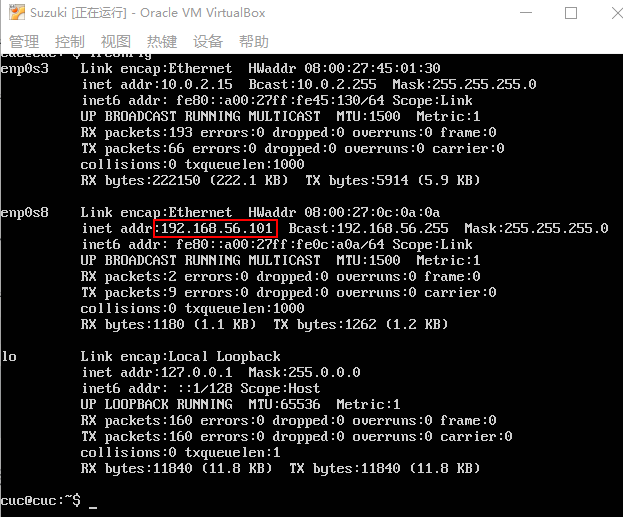

> dhclient命令使用动态主机配置协议动态的配置网络接口的网络参数。
2.sudo是linux系统管理指令，是允许系统管理员让普通用户执行一些或者全部的root命令的一个工具

- putty进行连接

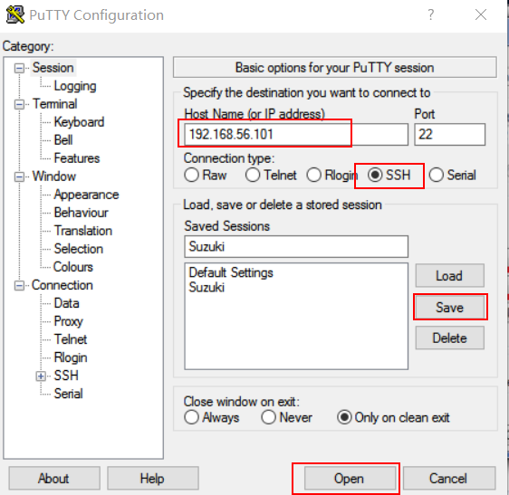
- 下载ubuntu 16.04.1的iso镜像文件到虚拟机

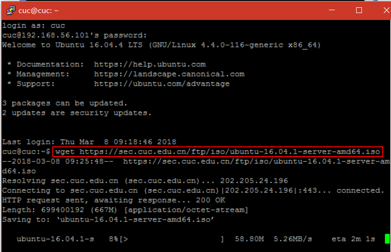

- 根据实验指导进行实验，命令如下

		# 在当前用户目录下创建一个用于挂载iso镜像文件的目录
		mkdir loopdir
		
		# 挂载iso镜像文件到该目录
		mount -o loop ubuntu-16.04.1-server-amd64.iso loopdir
		
		# 创建一个工作目录用于克隆光盘内容
		mkdir cd
		 
		# 同步光盘内容到目标工作目录
		# 一定要注意loopdir后的这个/，cd后面不能有/
		rsync -av loopdir/ cd
		
		# 卸载iso镜像
		umount loopdir
		
		# 进入目标工作目录
		cd cd/
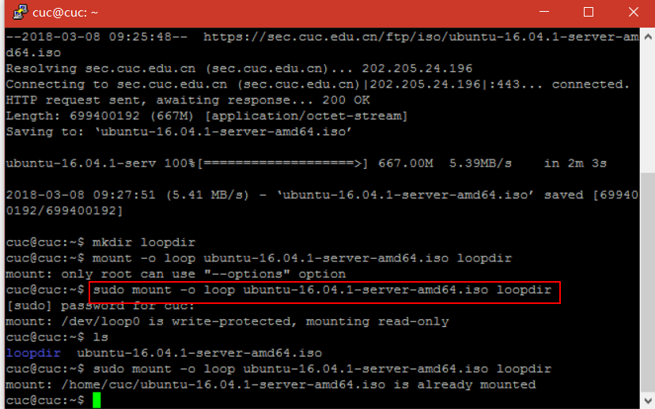

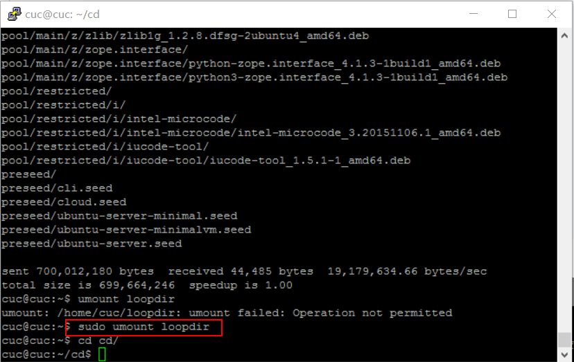
> 在操作过程中出现权限不够的情况，使用sudo来解决这个问题

- 编辑Ubuntu安装引导界面增加一个新菜单项入口

  
```
vim isolinux/txt.cfg
```
- 将以下内容添加到txt.cfg中然后强制保存退出
```
label autoinstall
  menu label ^Auto Install Ubuntu Server
  kernel /install/vmlinuz
  append  file=/cdrom/preseed/ubuntu-server-autoinstall.seed debian-installer/locale=en_US console-setup/layoutcode=us keyboard-configuration/layoutcode=us console-setup/ask_detect=false localechooser/translation/warn-light=true localechoosertranslation/warn-severe=true initrd=/install/initrd.gz root=/dev/ram rw quiet

```
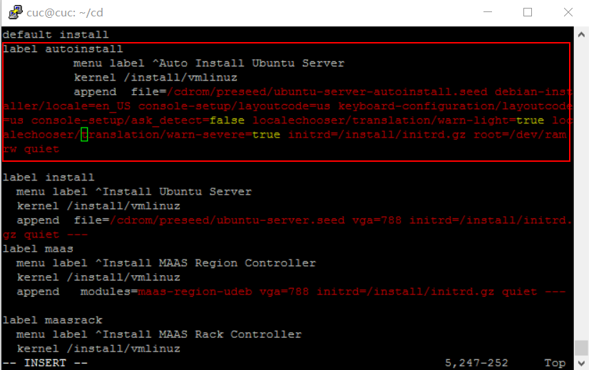

- 下载定制的seed，并将该文件保存到刚才创建的工作目录~/cd/preseed/ubuntu-server-autoinstall.seed

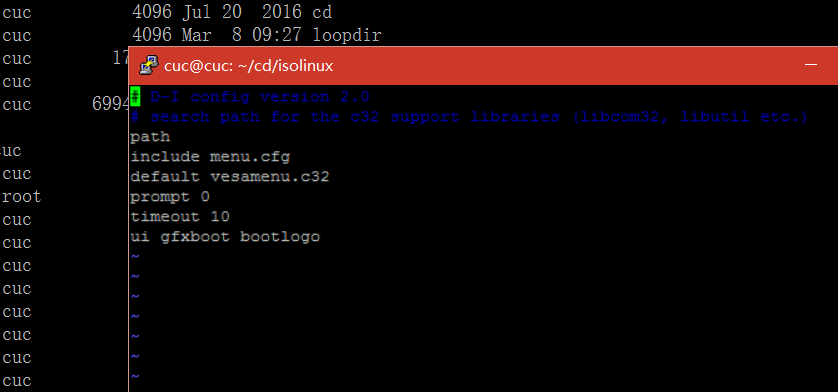

- 修改isolinux/isolinux.cfg，增加内容timeout 10

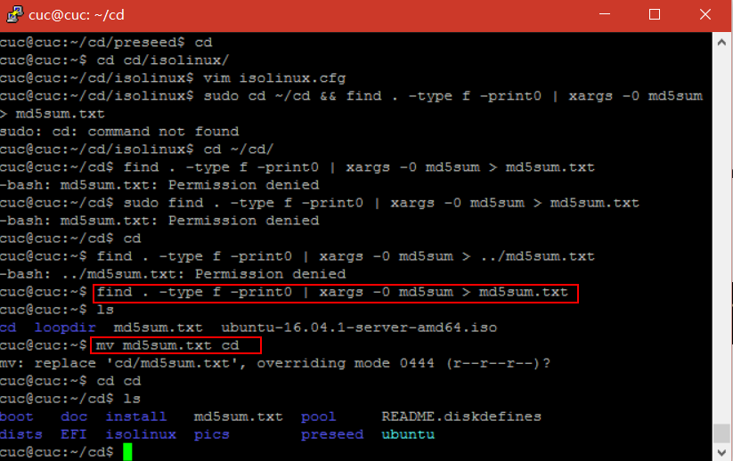

- 重新生成md5sum.txt
> 
```
cd ~/cd && find . -type f -print0 | xargs -0 md5sum > md5sum.txt

```
- 由于权限不够，请求被拒绝，因此在默认目录下生成md5sum.txt后再复制到目录cd/里去

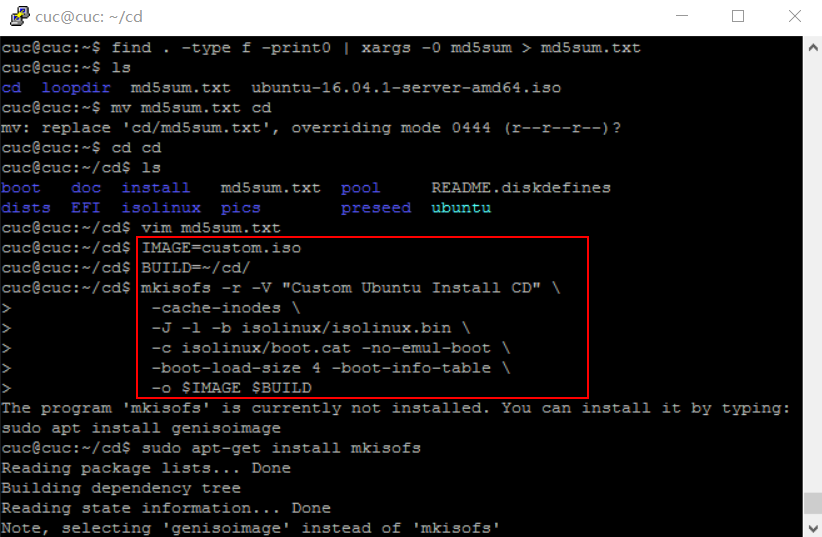

- 封闭改动后的目录到.iso

```
IMAGE=custom.iso
  BUILD=~/cd/

  mkisofs -r -V "Custom Ubuntu Install CD" \
              -cache-inodes \
              -J -l -b isolinux/isolinux.bin \
              -c isolinux/boot.cat -no-emul-boot \
              -boot-load-size 4 -boot-info-table \
              -o $IMAGE $BUILD


```
> 由于权限不足使用sudo运行

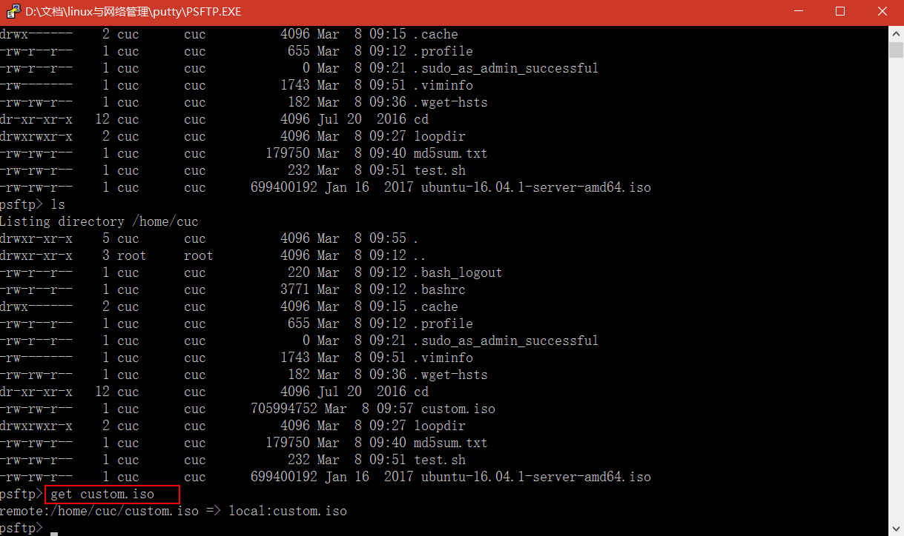

- 生成custom.iso，使用PSFTP传入宿主机。

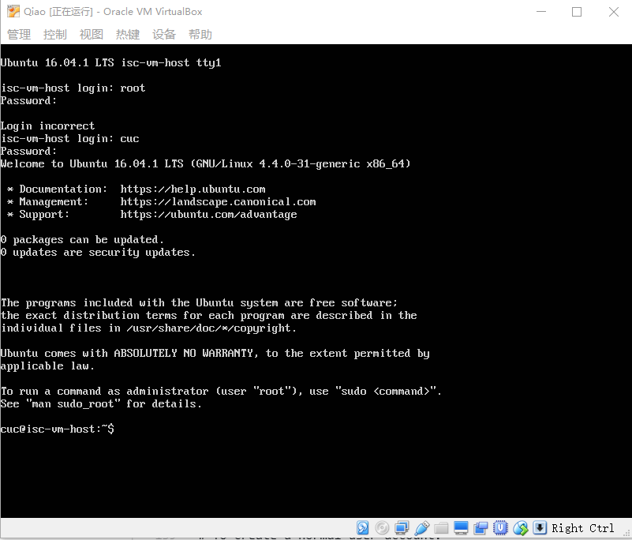

- 使用无人值守iso安装虚拟机


## 四 遇到的问题
- putty用桥接连接不上，因为不在同一网段（？），改用Host-Only后解决了...
- 权限不够，操作被拒绝了...使用sudo或者su root模式进行操作