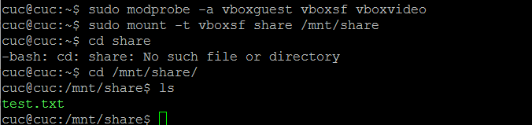
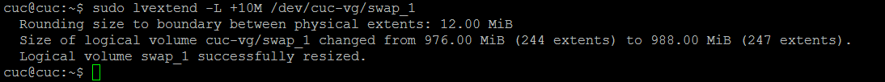

# Exp3 Systemd
## 一、实验环境

- Ubuntu 16.04 Server 64位
- asciinema
## 二、实验过程

systemctl是 Systemd 的主命令，用于管理系统。

尝试这些命令的时候，虚拟机都跟我说了声再见，然后在我截图之前就...
```
# 重启系统
$ sudo systemctl reboot

# 关闭系统，切断电源
$ sudo systemctl poweroff

# CPU停止工作
$ sudo systemctl halt

# 暂停系统
$ sudo systemctl suspend

# 让系统进入冬眠状态
$ sudo systemctl hibernate

# 让系统进入交互式休眠状态
$ sudo systemctl hybrid-sleep

# 启动进入救援状态（单用户状态）
$ sudo systemctl rescue

```
### 命令篇 
- systemd-analyze + hostnamectl+localectl

  - 视频链接：https://asciinema.org/a/H1yc7ZWDuFja1Q4Z9DcnTWp8R

- timedatectl + loginctl+Unit + Target + journalctl 

  - 视频链接：
   https://asciinema.org/a/fOXsNqNso7pt0e4mo2FK9u7GA
   https://asciinema.org/a/7BGoHqbQs51BECwA620QzdU2j
 
### 实战篇
https://asciinema.org/a/mS5GJEO119FI5K5OvGAyTwCfF

## 三、本章自查清单 
1. 如何添加一个用户并使其具备sudo执行程序的权限？ 

```
#添加用户  
adduser username   
# 将用户添加到sudo组 
sudo usermod -aG sudo username  

```
2. 如何将一个用户添加到一个用户组？ 
```shell  
sudo usermod -aG groupname username  
```  
3. 如何查看当前系统的分区表和文件系统详细信息？ 

```
fdisk -l 
或 df -T 
```

4. 如何实现开机自动挂载Virtualbox的共享目录分区？ 

```
#设置VirtualBox共享的本地文件夹
#安装增强功能 
sudo apt install virtualbox-guest-x11
#手动将iso文件挂载，使用mount将/dev/cdrom挂载 
mount -t vboxsf share /mnt/share    
#编辑/etc/systemd/system/Auto_mount_service_file.service
sudo systemctl enable  Auto_mount_service_file.service
```


出现错误：


执行：


5. 基于LVM（逻辑分卷管理）的分区如何实现动态扩容和缩减容量？
 - 显示分区情况
 
```
sudo lvdisplay
```


 - 扩容

```
sudo lvextend -L +10M /dev/cuc_vg/swap_1
```


 
 - 减容
 ```
sudo lvreduce -L -10M /dev/cuc_vg/swap_1
```


6. 如何通过systemd设置实现在网络连通时运行一个指定脚本，在网络断开时运行另一个脚本？
向networking.service的设置文件中添加：
通过systemctl status networking.service查看设置文件位置
```
ExecStartPre=/bin/bash /home/cuc/1.sh
ExecStartPost=/bin/bash /home/cuc/1.sh
```


7. 如何通过systemd设置实现一个脚本在任何情况下被杀死之后会立即重新启动？实现杀不死？
向配置文件中添加
```
Restart:always
```

