# SHELL脚本编程基础 

## 实验环境

- Ubuntu 16.04 Desktop 64bit

## 任务一：用bash编写一个图片批处理脚本

- 代码：[work_1.sh](code/work_1.sh)

- 帮助文档

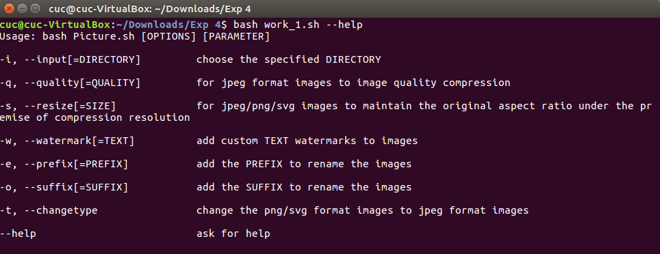

## 任务二：用bash编写一个文本批处理脚本，2014世界杯运动员数据 进行批量处理完成相应的数据统计任务： 

- 代码：[work_2.sh](code/work_2.sh)

- 帮助文档

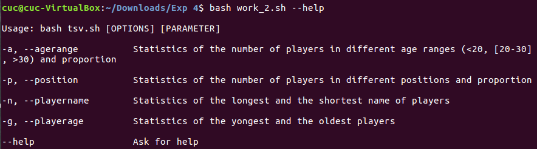

其他功能出现bug，一直无法对图片进行处理，程序也不退出

- 统计不同年龄区间范围（20岁以下、[20-30]、30岁以上）的球员数量、百分比

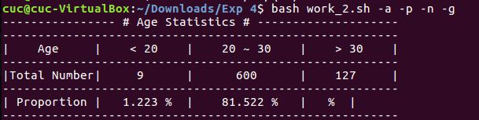

- 统计不同场上位置的球员数量、百分比

- 名字最长的球员是谁？名字最短的球员是谁？

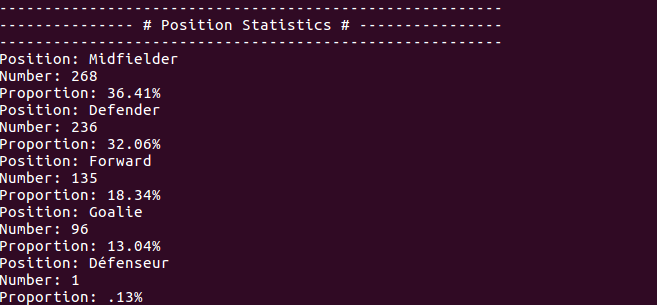

- 年龄最大的球员是谁？年龄最小的球员是谁？

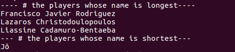

## 任务二：用bash编写一个文本批处理脚本，对Web服务器访问日志 进行批量处理完成相应的数据统计任务

- 代码：[work_3.sh](code/work_3.sh)

- 统计访问来源主机TOP 100和分别对应出现的总次数

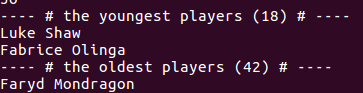

- 统计访问来源主机TOP 100 IP和分别对应出现的总次数

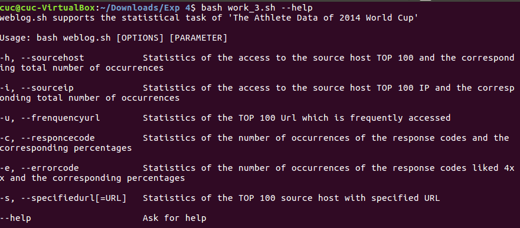

- 统计最频繁被访问的URL TOP 100

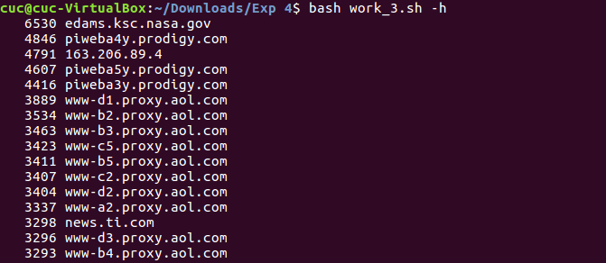

- 统计不同响应状态码的出现次数和对应百分比

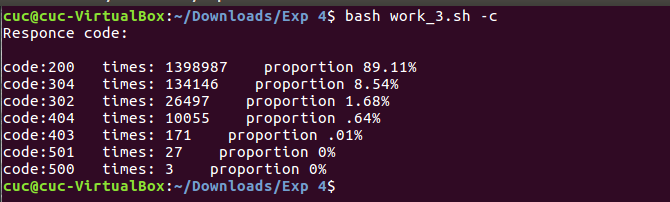

- 分别统计不同4XX状态码对应的TOP 10 URL和对应出现的总次数

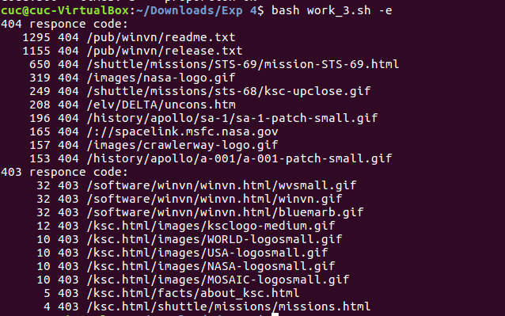

给定URL输出TOP 100访问来源主机

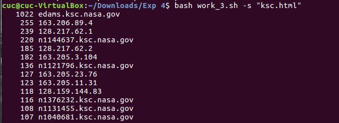

