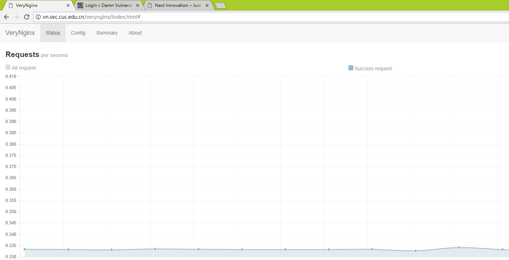

# 实验五 搭建高级的Web服务器
## 实验环境
- Ubuntu server 16.04（Host-Only：192.168.56.103）
- windows 10
- nginx 
- WordPress 4.7
- verynginx
## 服务器配置
- Wordpress： 端口：8080
- Verynginx： 端口：80
- Dvwa：      端口：8181
## 实验步骤
### 1.安装verynginx
#### 1.1 安装依赖包：

```
sudo apt-get install libpcre3-dev
sudo apt-get install libssl-dev
sudo apt-get install build-essential

```

#### 1.2 修改配置文件
- 编辑opt/verynginx/openresty/nginx/conf/nginx.conf，将user nginx修改为user www-data
- 设置python3为默认环境

```
ln -s /usr/bin/python3 /usr/bin/python
```

#### 1.3 启动verynginx

```
sudo /opt/verynginx/openresty/nginx/sbin/nginx
```

> 在任何路径使用sudo nginx，启动的是nginx；sudo nginx -s stop关闭nginx

> 关闭verynginx使用 sudo /opt/verynginx/openresty/nginx/sbin/nginx -s stop

- 如果出现下图情况：


端口被某进程占用，使用sudo lsof:端口号查看占用进程

使用sudo kill -9 进程ID结束进程。再运行verynginx

- 安装用户curl实验的ab


```
sudo apt install apache2-utils
```



### 2 安装Wordpress
- [Install Linux, Nginx, MySQL, PHP (LEMP stack) in Ubuntu 16.04](https://www.digitalocean.com/community/tutorials/how-to-install-linux-nginx-mysql-php-lemp-stack-in-ubuntu-16-04)
- [创建自签发SSL证书](https://www.digitalocean.com/community/tutorials/how-to-create-a-self-signed-ssl-certificate-for-nginx-in-ubuntu-16-04)
- [Install WordPress with LEMP on Ubuntu 16.04](https://www.digitalocean.com/community/tutorials/how-to-install-wordpress-with-lemp-on-ubuntu-16-04)


#### 2.1 按照教程安装Wordpress
通过修改nginx的监听端口，解除nginx与verynginx出现的端口监听冲突

- 修改 /etc/nginx/sites-available/default


#### 2.2 出现的问题
- 创建自签SSL后，nginx重启失败，显示8080端口被占用
- 通过结束进程，重启nginx，http和https都也无法访问页面


### 3 DVWA搭建
- 下载DVWA

```
git clone https://github.com/ethicalhack3r/DVWA.git
```

- 配置Nginx

```
sudo cp /etc/nginx/sites-available/default /etc/nginx/sites-availabledefault_dvwa
sudo vim /etc/nginx/sites-availabledefault_dvwa
sudo ln -s /etc/nginx/sites-available/default_dvwa /etc/nginx/sites-enabled/default_dvwa
sudo nginx -s reload
```
- 编辑DVWA相关设置

```
# 对于Dvwa显示的问题进行处理
cp /var/config.inc.php.dist /var/config.inc.php

# 修改/etc/php/7.0/fpm/php.ini
allow_url_include = On

# 重启php
sudo systemctl restart php7.0-fpm

# 添加reCAPTCHA key
在https://www.google.com/recaptcha/admin#list 中生成公私钥
添加进config.inc.php中

# 修改/var/www/html/dvwa/config/config.inc.php
修改数据库密码

# 更改文件夹权限
sudo chgrp www-data hackable/uploads
sudo chgrp www-data /var/www/html/dvwa/external//phpids/0.6/lib/IDS/tmp/phpids_log.txt
sudo chmod g+w hackable/uploads/
sudo chmod g+w /var/www/html/dvwa/external/phpids/0.6/lib/IDS/tmp/phpids_log.txt


```


### 4 安全加固
部分加固未生效

1.使用matcher和upstream和proxypass 进行反向代理


2.限制IP


3. DVWA的只允许白名单访问


4.修复Wordpress漏洞


5.针对DVWA的SQL注入实验低安全等级下的防护


6.verynginx访问白名单


7. 限制访问并发数


8.禁止curl访问

